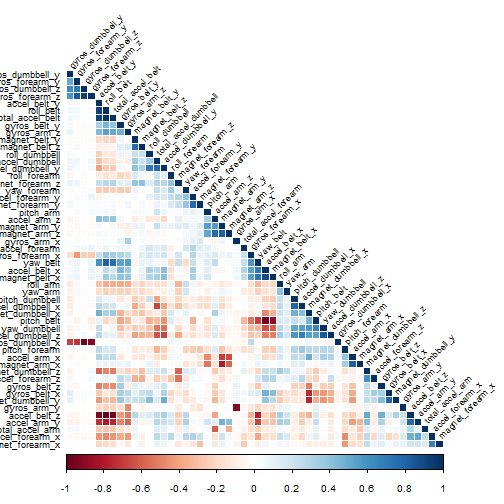
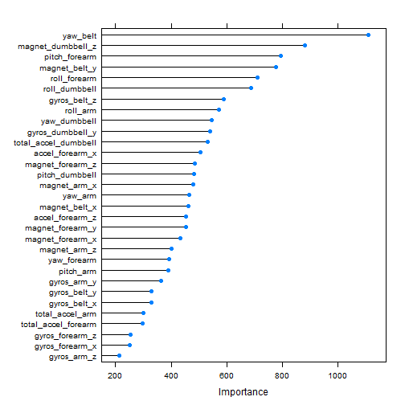

### Background
Using devices such as Jawbone Up, Nike FuelBand, and Fitbit it is now possible to collect a large amount of data about personal activity relatively inexpensively. These type of devices are part of the quantified self movement - a group of enthusiasts who take measurements about themselves regularly to improve their health, to find patterns in their behavior, or because they are tech geeks. One thing that people regularly do is quantify how much of a particular activity they do, but they rarely quantify how well they do it. In this project, your goal will be to use data from accelerometers on the belt, forearm, arm, and dumbell of 6 participants. They were asked to perform barbell lifts correctly and incorrectly in 5 different ways. More information is available from the website here: http://groupware.les.inf.puc-rio.br/har (see the section on the Weight Lifting Exercise Dataset). 

### Required Libraries

```r
require(dplyr)
require(mlbench)
require(caret)
require(randomForest)
require(corrplot)
```
### Get the Data
Let's download training set and testing set.

```r
if (!file.exists("pml-training.csv")){
    download.file(url = "https://d396qusza40orc.cloudfront.net/predmachlearn/pml-training.csv"
              , destfile ="pml-training.csv")
}
if (!file.exists("pml-testing.csv")){
  download.file(url = "https://d396qusza40orc.cloudfront.net/predmachlearn/pml-testing.csv"
              , destfile ="pml-testing.csv")  
}
```
Loading datasets in R and replace worng values with NAs

```r
training <- read.csv("pml-training.csv", na.strings=c("","NA","#DIV/0!"))
testing <- read.csv("pml-testing.csv", , na.strings=c("","NA","#DIV/0!"))
```

#### Clean the data

Checking for missing values 

```r
str(training)
```

```
## 'data.frame':	19622 obs. of  160 variables:
##  $ X                       : int  1 2 3 4 5 6 7 8 9 10 ...
##  $ user_name               : Factor w/ 6 levels "adelmo","carlitos",..: 2 2 2 2 2 2 2 2 2 2 ...
##  $ raw_timestamp_part_1    : int  1323084231 1323084231 1323084231 1323084232 1323084232 1323084232 1323084232 1323084232 1323084232 1323084232 ...
##  $ raw_timestamp_part_2    : int  788290 808298 820366 120339 196328 304277 368296 440390 484323 484434 ...
##  $ cvtd_timestamp          : Factor w/ 20 levels "02/12/2011 13:32",..: 9 9 9 9 9 9 9 9 9 9 ...
##  $ new_window              : Factor w/ 2 levels "no","yes": 1 1 1 1 1 1 1 1 1 1 ...
##  $ num_window              : int  11 11 11 12 12 12 12 12 12 12 ...
##  $ roll_belt               : num  1.41 1.41 1.42 1.48 1.48 1.45 1.42 1.42 1.43 1.45 ...
##  $ pitch_belt              : num  8.07 8.07 8.07 8.05 8.07 8.06 8.09 8.13 8.16 8.17 ...
##  $ yaw_belt                : num  -94.4 -94.4 -94.4 -94.4 -94.4 -94.4 -94.4 -94.4 -94.4 -94.4 ...
##  $ total_accel_belt        : int  3 3 3 3 3 3 3 3 3 3 ...
##  $ kurtosis_roll_belt      : num  NA NA NA NA NA NA NA NA NA NA ...
##  $ kurtosis_picth_belt     : num  NA NA NA NA NA NA NA NA NA NA ...
##  $ kurtosis_yaw_belt       : logi  NA NA NA NA NA NA ...
##  $ skewness_roll_belt      : num  NA NA NA NA NA NA NA NA NA NA ...
##  $ skewness_roll_belt.1    : num  NA NA NA NA NA NA NA NA NA NA ...
##  $ skewness_yaw_belt       : logi  NA NA NA NA NA NA ...
##  $ max_roll_belt           : num  NA NA NA NA NA NA NA NA NA NA ...
##  $ max_picth_belt          : int  NA NA NA NA NA NA NA NA NA NA ...
##  $ max_yaw_belt            : num  NA NA NA NA NA NA NA NA NA NA ...
##  $ min_roll_belt           : num  NA NA NA NA NA NA NA NA NA NA ...
##  $ min_pitch_belt          : int  NA NA NA NA NA NA NA NA NA NA ...
##  $ min_yaw_belt            : num  NA NA NA NA NA NA NA NA NA NA ...
##  $ amplitude_roll_belt     : num  NA NA NA NA NA NA NA NA NA NA ...
##  $ amplitude_pitch_belt    : int  NA NA NA NA NA NA NA NA NA NA ...
##  $ amplitude_yaw_belt      : num  NA NA NA NA NA NA NA NA NA NA ...
##  $ var_total_accel_belt    : num  NA NA NA NA NA NA NA NA NA NA ...
##  $ avg_roll_belt           : num  NA NA NA NA NA NA NA NA NA NA ...
##  $ stddev_roll_belt        : num  NA NA NA NA NA NA NA NA NA NA ...
##  $ var_roll_belt           : num  NA NA NA NA NA NA NA NA NA NA ...
##  $ avg_pitch_belt          : num  NA NA NA NA NA NA NA NA NA NA ...
##  $ stddev_pitch_belt       : num  NA NA NA NA NA NA NA NA NA NA ...
##  $ var_pitch_belt          : num  NA NA NA NA NA NA NA NA NA NA ...
##  $ avg_yaw_belt            : num  NA NA NA NA NA NA NA NA NA NA ...
##  $ stddev_yaw_belt         : num  NA NA NA NA NA NA NA NA NA NA ...
##  $ var_yaw_belt            : num  NA NA NA NA NA NA NA NA NA NA ...
##  $ gyros_belt_x            : num  0 0.02 0 0.02 0.02 0.02 0.02 0.02 0.02 0.03 ...
##  $ gyros_belt_y            : num  0 0 0 0 0.02 0 0 0 0 0 ...
##  $ gyros_belt_z            : num  -0.02 -0.02 -0.02 -0.03 -0.02 -0.02 -0.02 -0.02 -0.02 0 ...
##  $ accel_belt_x            : int  -21 -22 -20 -22 -21 -21 -22 -22 -20 -21 ...
##  $ accel_belt_y            : int  4 4 5 3 2 4 3 4 2 4 ...
##  $ accel_belt_z            : int  22 22 23 21 24 21 21 21 24 22 ...
##  $ magnet_belt_x           : int  -3 -7 -2 -6 -6 0 -4 -2 1 -3 ...
##  $ magnet_belt_y           : int  599 608 600 604 600 603 599 603 602 609 ...
##  $ magnet_belt_z           : int  -313 -311 -305 -310 -302 -312 -311 -313 -312 -308 ...
##  $ roll_arm                : num  -128 -128 -128 -128 -128 -128 -128 -128 -128 -128 ...
##  $ pitch_arm               : num  22.5 22.5 22.5 22.1 22.1 22 21.9 21.8 21.7 21.6 ...
##  $ yaw_arm                 : num  -161 -161 -161 -161 -161 -161 -161 -161 -161 -161 ...
##  $ total_accel_arm         : int  34 34 34 34 34 34 34 34 34 34 ...
##  $ var_accel_arm           : num  NA NA NA NA NA NA NA NA NA NA ...
##  $ avg_roll_arm            : num  NA NA NA NA NA NA NA NA NA NA ...
##  $ stddev_roll_arm         : num  NA NA NA NA NA NA NA NA NA NA ...
##  $ var_roll_arm            : num  NA NA NA NA NA NA NA NA NA NA ...
##  $ avg_pitch_arm           : num  NA NA NA NA NA NA NA NA NA NA ...
##  $ stddev_pitch_arm        : num  NA NA NA NA NA NA NA NA NA NA ...
##  $ var_pitch_arm           : num  NA NA NA NA NA NA NA NA NA NA ...
##  $ avg_yaw_arm             : num  NA NA NA NA NA NA NA NA NA NA ...
##  $ stddev_yaw_arm          : num  NA NA NA NA NA NA NA NA NA NA ...
##  $ var_yaw_arm             : num  NA NA NA NA NA NA NA NA NA NA ...
##  $ gyros_arm_x             : num  0 0.02 0.02 0.02 0 0.02 0 0.02 0.02 0.02 ...
##  $ gyros_arm_y             : num  0 -0.02 -0.02 -0.03 -0.03 -0.03 -0.03 -0.02 -0.03 -0.03 ...
##  $ gyros_arm_z             : num  -0.02 -0.02 -0.02 0.02 0 0 0 0 -0.02 -0.02 ...
##  $ accel_arm_x             : int  -288 -290 -289 -289 -289 -289 -289 -289 -288 -288 ...
##  $ accel_arm_y             : int  109 110 110 111 111 111 111 111 109 110 ...
##  $ accel_arm_z             : int  -123 -125 -126 -123 -123 -122 -125 -124 -122 -124 ...
##  $ magnet_arm_x            : int  -368 -369 -368 -372 -374 -369 -373 -372 -369 -376 ...
##  $ magnet_arm_y            : int  337 337 344 344 337 342 336 338 341 334 ...
##  $ magnet_arm_z            : int  516 513 513 512 506 513 509 510 518 516 ...
##  $ kurtosis_roll_arm       : num  NA NA NA NA NA NA NA NA NA NA ...
##  $ kurtosis_picth_arm      : num  NA NA NA NA NA NA NA NA NA NA ...
##  $ kurtosis_yaw_arm        : num  NA NA NA NA NA NA NA NA NA NA ...
##  $ skewness_roll_arm       : num  NA NA NA NA NA NA NA NA NA NA ...
##  $ skewness_pitch_arm      : num  NA NA NA NA NA NA NA NA NA NA ...
##  $ skewness_yaw_arm        : num  NA NA NA NA NA NA NA NA NA NA ...
##  $ max_roll_arm            : num  NA NA NA NA NA NA NA NA NA NA ...
##  $ max_picth_arm           : num  NA NA NA NA NA NA NA NA NA NA ...
##  $ max_yaw_arm             : int  NA NA NA NA NA NA NA NA NA NA ...
##  $ min_roll_arm            : num  NA NA NA NA NA NA NA NA NA NA ...
##  $ min_pitch_arm           : num  NA NA NA NA NA NA NA NA NA NA ...
##  $ min_yaw_arm             : int  NA NA NA NA NA NA NA NA NA NA ...
##  $ amplitude_roll_arm      : num  NA NA NA NA NA NA NA NA NA NA ...
##  $ amplitude_pitch_arm     : num  NA NA NA NA NA NA NA NA NA NA ...
##  $ amplitude_yaw_arm       : int  NA NA NA NA NA NA NA NA NA NA ...
##  $ roll_dumbbell           : num  13.1 13.1 12.9 13.4 13.4 ...
##  $ pitch_dumbbell          : num  -70.5 -70.6 -70.3 -70.4 -70.4 ...
##  $ yaw_dumbbell            : num  -84.9 -84.7 -85.1 -84.9 -84.9 ...
##  $ kurtosis_roll_dumbbell  : num  NA NA NA NA NA NA NA NA NA NA ...
##  $ kurtosis_picth_dumbbell : num  NA NA NA NA NA NA NA NA NA NA ...
##  $ kurtosis_yaw_dumbbell   : logi  NA NA NA NA NA NA ...
##  $ skewness_roll_dumbbell  : num  NA NA NA NA NA NA NA NA NA NA ...
##  $ skewness_pitch_dumbbell : num  NA NA NA NA NA NA NA NA NA NA ...
##  $ skewness_yaw_dumbbell   : logi  NA NA NA NA NA NA ...
##  $ max_roll_dumbbell       : num  NA NA NA NA NA NA NA NA NA NA ...
##  $ max_picth_dumbbell      : num  NA NA NA NA NA NA NA NA NA NA ...
##  $ max_yaw_dumbbell        : num  NA NA NA NA NA NA NA NA NA NA ...
##  $ min_roll_dumbbell       : num  NA NA NA NA NA NA NA NA NA NA ...
##  $ min_pitch_dumbbell      : num  NA NA NA NA NA NA NA NA NA NA ...
##  $ min_yaw_dumbbell        : num  NA NA NA NA NA NA NA NA NA NA ...
##  $ amplitude_roll_dumbbell : num  NA NA NA NA NA NA NA NA NA NA ...
##   [list output truncated]
```
There's a lot of missing values! We need remove the collumns that contain NAs Values

```r
getCollumnsWithoutNA <- function(data){
    collumns <- c()
    col <- dim(data)[2]
    for (i in seq(1:col)){
        nas <- sum(is.na(data[,i]))
        if (nas == 0) {
            collumns <- c(collumns ,i)
        }
    }
    collumns
}
collumns <- getCollumnsWithoutNA(training)
training <- select(training, collumns)
```

Now, we need remove non-important collumns that do not come from accelerometer measurements like X, raw_timestamps and num_window collumns.


```r
training <- training[, -c(1:7)]
```

### Exploratory Analysis

OK! it's time to explore the data. On this step, we are searching for correlations between features of data.

#### Find correlations and discard high correlated features

```r
correlationMatrix <- cor(select(training, -classe))
```

Let' make a correlation graph to better understanding.


```r
corrplot(correlationMatrix, method = "color", type="lower", order="hclust", tl.cex = 0.75, tl.col="black", tl.srt = 45)
```

 

Saving the most correlated variables to remove from training set ( > 0.75)


```r
highlyCorrelated <- findCorrelation(correlationMatrix, cutoff=0.75)
training_data <- select(training, -highlyCorrelated)
summary(training_data)
```

```
##     yaw_belt        gyros_belt_x        gyros_belt_y     
##  Min.   :-180.00   Min.   :-1.040000   Min.   :-0.64000  
##  1st Qu.: -88.30   1st Qu.:-0.030000   1st Qu.: 0.00000  
##  Median : -13.00   Median : 0.030000   Median : 0.02000  
##  Mean   : -11.21   Mean   :-0.005592   Mean   : 0.03959  
##  3rd Qu.:  12.90   3rd Qu.: 0.110000   3rd Qu.: 0.11000  
##  Max.   : 179.00   Max.   : 2.220000   Max.   : 0.64000  
##   gyros_belt_z     magnet_belt_x   magnet_belt_y      roll_arm      
##  Min.   :-1.4600   Min.   :-52.0   Min.   :354.0   Min.   :-180.00  
##  1st Qu.:-0.2000   1st Qu.:  9.0   1st Qu.:581.0   1st Qu.: -31.77  
##  Median :-0.1000   Median : 35.0   Median :601.0   Median :   0.00  
##  Mean   :-0.1305   Mean   : 55.6   Mean   :593.7   Mean   :  17.83  
##  3rd Qu.:-0.0200   3rd Qu.: 59.0   3rd Qu.:610.0   3rd Qu.:  77.30  
##  Max.   : 1.6200   Max.   :485.0   Max.   :673.0   Max.   : 180.00  
##    pitch_arm          yaw_arm          total_accel_arm  gyros_arm_y     
##  Min.   :-88.800   Min.   :-180.0000   Min.   : 1.00   Min.   :-3.4400  
##  1st Qu.:-25.900   1st Qu.: -43.1000   1st Qu.:17.00   1st Qu.:-0.8000  
##  Median :  0.000   Median :   0.0000   Median :27.00   Median :-0.2400  
##  Mean   : -4.612   Mean   :  -0.6188   Mean   :25.51   Mean   :-0.2571  
##  3rd Qu.: 11.200   3rd Qu.:  45.8750   3rd Qu.:33.00   3rd Qu.: 0.1400  
##  Max.   : 88.500   Max.   : 180.0000   Max.   :66.00   Max.   : 2.8400  
##   gyros_arm_z       magnet_arm_x     magnet_arm_z    roll_dumbbell    
##  Min.   :-2.3300   Min.   :-584.0   Min.   :-597.0   Min.   :-153.71  
##  1st Qu.:-0.0700   1st Qu.:-300.0   1st Qu.: 131.2   1st Qu.: -18.49  
##  Median : 0.2300   Median : 289.0   Median : 444.0   Median :  48.17  
##  Mean   : 0.2695   Mean   : 191.7   Mean   : 306.5   Mean   :  23.84  
##  3rd Qu.: 0.7200   3rd Qu.: 637.0   3rd Qu.: 545.0   3rd Qu.:  67.61  
##  Max.   : 3.0200   Max.   : 782.0   Max.   : 694.0   Max.   : 153.55  
##  pitch_dumbbell     yaw_dumbbell      total_accel_dumbbell
##  Min.   :-149.59   Min.   :-150.871   Min.   : 0.00       
##  1st Qu.: -40.89   1st Qu.: -77.644   1st Qu.: 4.00       
##  Median : -20.96   Median :  -3.324   Median :10.00       
##  Mean   : -10.78   Mean   :   1.674   Mean   :13.72       
##  3rd Qu.:  17.50   3rd Qu.:  79.643   3rd Qu.:19.00       
##  Max.   : 149.40   Max.   : 154.952   Max.   :58.00       
##  gyros_dumbbell_y   magnet_dumbbell_z  roll_forearm       pitch_forearm   
##  Min.   :-2.10000   Min.   :-262.00   Min.   :-180.0000   Min.   :-72.50  
##  1st Qu.:-0.14000   1st Qu.: -45.00   1st Qu.:  -0.7375   1st Qu.:  0.00  
##  Median : 0.03000   Median :  13.00   Median :  21.7000   Median :  9.24  
##  Mean   : 0.04606   Mean   :  46.05   Mean   :  33.8265   Mean   : 10.71  
##  3rd Qu.: 0.21000   3rd Qu.:  95.00   3rd Qu.: 140.0000   3rd Qu.: 28.40  
##  Max.   :52.00000   Max.   : 452.00   Max.   : 180.0000   Max.   : 89.80  
##   yaw_forearm      total_accel_forearm gyros_forearm_x  
##  Min.   :-180.00   Min.   :  0.00      Min.   :-22.000  
##  1st Qu.: -68.60   1st Qu.: 29.00      1st Qu.: -0.220  
##  Median :   0.00   Median : 36.00      Median :  0.050  
##  Mean   :  19.21   Mean   : 34.72      Mean   :  0.158  
##  3rd Qu.: 110.00   3rd Qu.: 41.00      3rd Qu.:  0.560  
##  Max.   : 180.00   Max.   :108.00      Max.   :  3.970  
##  gyros_forearm_z    accel_forearm_x   accel_forearm_z   magnet_forearm_x 
##  Min.   : -8.0900   Min.   :-498.00   Min.   :-446.00   Min.   :-1280.0  
##  1st Qu.: -0.1800   1st Qu.:-178.00   1st Qu.:-182.00   1st Qu.: -616.0  
##  Median :  0.0800   Median : -57.00   Median : -39.00   Median : -378.0  
##  Mean   :  0.1512   Mean   : -61.65   Mean   : -55.29   Mean   : -312.6  
##  3rd Qu.:  0.4900   3rd Qu.:  76.00   3rd Qu.:  26.00   3rd Qu.:  -73.0  
##  Max.   :231.0000   Max.   : 477.00   Max.   : 291.00   Max.   :  672.0  
##  magnet_forearm_y magnet_forearm_z classe  
##  Min.   :-896.0   Min.   :-973.0   A:5580  
##  1st Qu.:   2.0   1st Qu.: 191.0   B:3797  
##  Median : 591.0   Median : 511.0   C:3422  
##  Mean   : 380.1   Mean   : 393.6   D:3216  
##  3rd Qu.: 737.0   3rd Qu.: 653.0   E:3607  
##  Max.   :1480.0   Max.   :1090.0
```

Now, the dimension of training set is:


```r
dim(training_data)
```

```
## [1] 19622    32
```
### Build the Model

Before create the model, we will create a cross validation partition for training set. 20% for test and 80% fro training:


```r
tControl <- trainControl(method="cv", number = 5)
```

Now, create the model an training with dataset.
We are using Random forests model. the RF build lots of bushy trees, and then average them to reduce the variance. 


```r
set.seed(123)

if (file.exists("rfmodel001.rds")){
    rfmodel <- readRDS("rfmodel001.rds")
} else{
    unloadNamespace("dplyr")
    tControl <- trainControl(method="cv", number = 5)
    rfmodel <- train(classe ~ ., data = training_data, 
                 method="rf", 
                 trControl=tControl, 
                 prox=TRUE)
    saveRDS(rfmodel, "rfmodel001.rds")
}
```

#### Estimate variable importance

```r
importance <- varImp(rfmodel, scale=FALSE)
plot(importance)
```

 

The graph shows a rank of variable importance. We can see on the top, that most principal variables that influences the outcomes and contribute to discriminate the data among the classes.

### Result

```r
rfmodel$finalModel
```

```
## 
## Call:
##  randomForest(x = x, y = y, mtry = param$mtry, verbose = TRUE) 
##                Type of random forest: classification
##                      Number of trees: 500
## No. of variables tried at each split: 2
## 
##         OOB estimate of  error rate: 0.57%
## Confusion matrix:
##      A    B    C    D    E  class.error
## A 5575    4    0    0    1 0.0008960573
## B   14 3775    7    0    1 0.0057940479
## C    0   18 3392   12    0 0.0087668030
## D    0    0   46 3168    2 0.0149253731
## E    0    1    1    5 3600 0.0019406709
```

Finnaly, The Random Forest model shows OOB estimate of error rate: 0.57% for the training data. the out of sample error is:


```r
1 - rfmodel$results$Accuracy[1]
```

```
## [1] 0.008491892
```
Seems very promising!

Predict classes for Testing set

```r
require(dplyr)
testing <- select(testing, collumns)
testing <- testing[, -c(1:7)]
predict(rfmodel, testing)
```

```
##  [1] B A B A A E D B A A B C B A E E A B B B
## Levels: A B C D E
```
### Conclusion

We found that the model achieved an excellent performance. The correlation-based select feature method was significant to reduce the time spent on training data. So, for this problem, it was not necessary to build other models based on other algorithms of machine learning.


